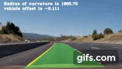

## Advanced Lane Finding

[image6]: ./output_images/test3/final.jpg "Final output image"
[video1]: ./project_video_output.mp4 "Video"
The aim of this work is to built an advanced algorithm for autonomous cars to detect the lane lines. The scripts are in Python using OpenCV.

The steps of this project are the following:

* Compute the camera calibration matrix and distortion coefficients given a set of chessboard images.
* Apply a distortion correction to raw images.
* Use color transforms, gradients, etc., to create a thresholded binary image.
* Apply a perspective transform to rectify binary image ("birds-eye view").
* Detect lane pixels and fit to find the lane boundary.
* Determine the curvature of the lane and vehicle position with respect to center.
* Warp the detected lane boundaries back onto the original image.
* Output visual display of the lane boundaries and numerical estimation of lane curvature and vehicle position.

Detailed description of how to incoorperate the above mentioned steps is in `Report.md`. Random input images are checked and results are stored in output_images.
Output video is in `project_video_output`

Final image looks like:

![alt text][image6]
